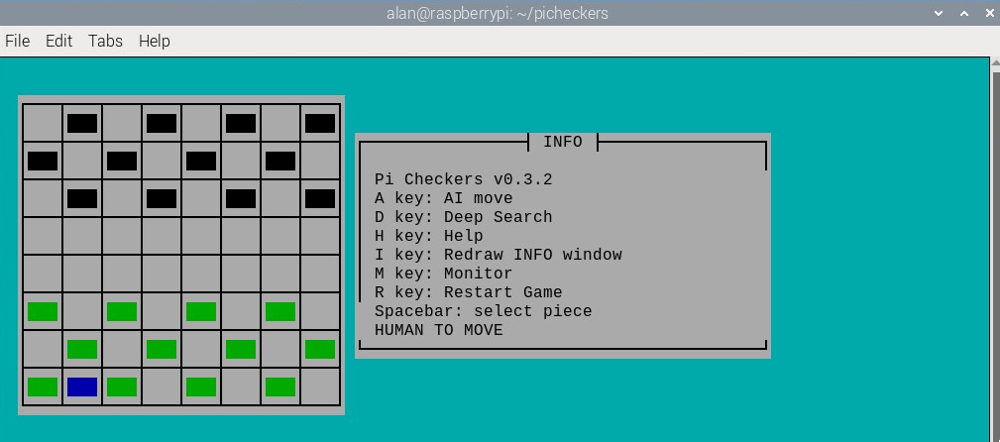
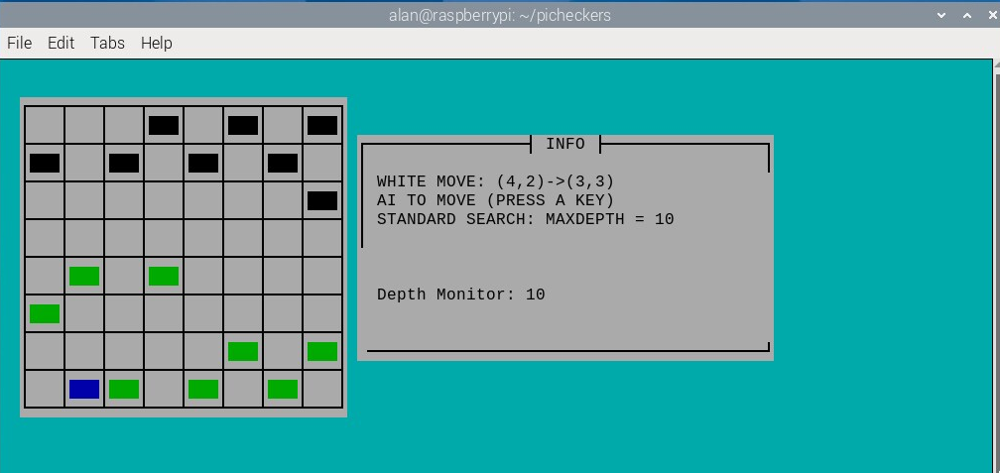

# Pi Checkers

Pi Checkers is a demo of the classic human-vs-computer checkers game for the Raspberry Pi. 

It can be run from the terminal and uses ncurses for the user interface so that Pi Checkers can be played by users who ssh into their Raspberry Pi.

A screenshot is shown below.

 

## Checkers Rules

Checkers is a two-player strategy game played on an 8×8 checkerboard which involve diagonal moves of circular game pieces and mandatory captures by jumping over opponent pieces. In Britain, American checkers is known as Draughts.

In checkers there are two opponents on opposite sides of the game board. One player is called the white player and the other is called the black player (computer AI in this case). White moves first, then players take alternate turns. Obviously, the white player cannot move the black player's pieces and vice versa. In this game the white pieces are coloured green. Ncurses only supports 8 colours. 

A move consists of moving a piece forward to a diagonal adjacent unoccupied square. If the adjacent square contains an opponent's piece, and the square immediately beyond it is unoccupied, then the opponent piece must be captured and is removed from the game by jumping over it. This is called a jump move. A piece can only move forward into an unoccupied square. When jumping an opponent's piece is possible then this must be done and can involve multiple jumps. 

When a piece reaches the other end of the board it becomes a king and can move and capture diagonally in all directions.

### Updates

The code will be updated as and when I find bugs or make other improvements such as enhancing the AI algorithm. User options will be added in future updates.

### Pre-built Binary

A 64 bit pre-built binary is available for the Raspberry Pi4 and can be downloaded from the binary folder. The Pi Checkers executable can be run from a terminal as shown below.

```
./picheckers
```

The checkers binary must have executable permissions. Use the command below if necessary.

```
chmod +x picheckers
```

## Usage

This is a player-vs-computer game. You (the human player) move a player piece (green piece) on the board by first moving the (blue) cursor to the start piece position and pressing the spacebar and then moving the cursor to the end piece position on the board and pressing the spacebar again. So, move to start location and press spacebar and then move to end location and press spacebar. The cursor colour is blue and the cursor is returned to the bottom left hand corner of the board after a move has been made (i.e. x=0, y=0). Press the a-key (A for AI) to get the built-in AI to respond to your move. Make sure cap-lock is off before pressing the A key.

If the human player can make a multiple jump then you jump the first piece and then jump the second piece and so on. The AI can also make multiple jumps. You press the a-key again. Information on the current state of play is shown in an information window next to the checker board. If you get a "white illegal move" it usually means that you have to jump elsewhere or you have tried to move to a position which is not allowed. Start the move again.

When a piece reaches the other end of the board it becomes a king and the piece is given a diamond crown.

There are not many options in this early version of Pi Checkers. However, if you resize the terminal window and the INFO display disappears you can press the i-key to restart the info display.

Use cntl+C to finish.

## AI

The AI uses a minimax algorithm.

 

## Build From Source

The C source code for Pi Checkers is provided in the src directory. 

To compile you need to install the ncurses library as shown below.

```
sudo apt-get update
sudo apt install libncurses-dev
```

To determine which version of ncurses is installed use the following command.

```
dpkg -l '*ncurses*' | grep '^ii'
```

Use the MAKEFILE to compile. 

```
make
```

To run Pi Checkers from the terminal use

```
./picheckers
```

Pi Checkers can be compiled on other Linux systems once the ncurses library has been installed. [Geany](https://www.geany.org/) was used as the  code editor for developing this project.

## Versioning

[SemVer](http://semver.org/) is used for versioning. The version number has the form 0.0.0 representing major, minor and bug fix changes.

## Author

* **Alan Crispin** [Github](https://github.com/crispinprojects)

## License

Pi Checkers is licensed under LGPL v2.1. 

## Project Status

Active.

## Acknowledgements

* [Raspberry Pi Foundation](https://www.raspberrypi.org/)

* [Geany](https://www.geany.org/) is a lightweight source-code editor [GPL v2 license](https://www.gnu.org/licenses/old-licenses/gpl-2.0.txt)
