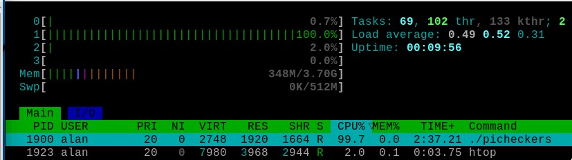

# Pi Checkers

Pi Checkers is a demo of the classic human-vs-computer checkers game for the Raspberry Pi. 

It can be run from the terminal and uses ncurses for the user interface so that Pi Checkers can be played by users who [ssh](https://www.raspberrypi.com/documentation/computers/remote-access.html) into their Raspberry Pi.

A screenshot is shown below.

 

## Checkers Rules

Checkers is a two-player strategy game played on an 8×8 checkerboard which involve diagonal moves of circular game pieces and mandatory captures by jumping over opponent pieces. In Britain, American checkers is known as Draughts.

In checkers there are two opponents on opposite sides of the game board. One player is called the white player and the other is called the black player (computer AI in this case). White moves first, then players take alternate turns. Obviously, the white player cannot move the black player's pieces and vice versa. In this game the white pieces are coloured green. Ncurses only supports 8 colours. 

A move consists of moving a piece forward to a diagonal adjacent unoccupied square. If the adjacent square contains an opponent's piece, and the square immediately beyond it is unoccupied, then the opponent piece must be captured and is removed from the game by jumping over it. This is called a jump move. A piece can only move forward into an unoccupied square. When jumping an opponent's piece is possible then this must be done and can involve multiple jumps. 

When a piece reaches the other end of the board it becomes a king and can move and capture diagonally in all directions.

### Pre-built Binary

A 64 bit pre-built binary is available for the Raspberry Pi4 and can be downloaded from the binary folder. The Pi Checkers executable can be run from a terminal as shown below.

```
./picheckers
```

The checkers binary must have executable permissions. Use the command below if necessary.

```
chmod +x picheckers
```

## Usage

This is a human-vs-computer game. You (the human player) first move a player piece on the board. To do this use the keyboard arrow keys to move the blue cursor to the start piece position and press the space-bar to select. Then move the blue cursor to the end piece position on the board and then press the space-bar again to select the end point. So, ***move to start location and press space-bar and then move to end location and press space-bar***.  The cursor is returned to the bottom left of the board after a move has been made (i.e. x=1, y=0). Press the ***A key*** (A for AI) with caps lock off to get the built-in AI to respond to your move. Make sure cap-lock is off before pressing the A key. The cursor colour is blue, the human white player is light green and the AI is black.

If the human player can make a multiple jump then you jump the first piece and then jump the second piece and so on. The AI can also make multiple jumps. You press the A Key again. Information on the current state of play is shown in an information window next to the checker board. If you get a "white illegal move" it usually means that you have to jump elsewhere or you have tried to move to a position which is not allowed. Start the move again.

When a piece reaches the other end of the board it becomes a king and the piece is given a diamond crown.

### Keys

```
A key: AI move
D key: Deep Search (toggle)
H key: Help
I key: Redraw INFO window
R key: Restart Game
Space-bar: select piece at cursor position
cntl+C: Quit
```

If you resize the terminal window and the INFO display disappears you can press the  I key (caps lock off) to restart the info display.

Use cntl+C to finish.

## AI

The AI uses a [minimax](https://en.wikipedia.org/wiki/Minimax) algorithm. There is a MIT OpenCourseWare lecture on the minimax algorithm [here](https://www.youtube.com/watch?v=STjW3eH0Cik&t=13s). My minimax algorithm takes piece capture mechanics into account.

 

In the minimax algorithm the depth limit specifies the number of turns to look ahead in the game (search) tree. A higher depth provides a greater chance of playing a better move. However, the minimax algorithm becomes slow when using a large search depth. With Pi Checkers you can toggle the depth search limit using the D Key (caps lock off). This toggles the deep-search mode (maximum depth set to 14) on and off from its normal limit of 8.

 

If using the deep-search mode it is best to use [htop](https://htop.dev/) to monitor processor activity. With the Raspberry Pi you can install it using the command below.

```
sudo apt install htop
```

The screenshots below show a deep-search move before and after and monitoring this using htop.

 
 
 

Htop shows processor activity  and memory useage when deep searching.

## Build From Source

The C source code for Pi Checkers is provided in the src directory. 

To compile you need to install the ncurses library as shown below.

```
sudo apt-get update
sudo apt install libncurses-dev
```

To determine which version of ncurses is installed use the following command.

```
dpkg -l '*ncurses*' | grep '^ii'
```

Use the MAKEFILE to compile. 

```
make
```

To run Pi Checkers from the terminal use

```
./picheckers
```

Pi Checkers can be compiled on other Linux systems once the ncurses library has been installed. [Geany](https://www.geany.org/) was used as the  code editor for developing this project.

Make clean is also supported.

```
make clean
```

### Future Work

The code will be updated as and when I find bugs or make other improvements such as enhancing the minimax jump algorithm.

The minimax jump algorithm is slow when put into the deep-search mode. Future work will explore if a parallel version of the minimax search algorithm can be developed to reduce search time. 

## Version Control

[SemVer](http://semver.org/) is used for version control. The version number has the form 0.0.0 representing major, minor and bug fix changes.

## Author

* **Alan Crispin** [Github](https://github.com/crispinprojects)

## License

Pi Checkers is licensed under LGPL v2.1. 

## Project Status

Active.

## Acknowledgements

* [Raspberry Pi Foundation](https://www.raspberrypi.org/)

* [Geany](https://www.geany.org/) is a lightweight source-code editor [GPL v2 license](https://www.gnu.org/licenses/old-licenses/gpl-2.0.txt)

* [MIT OpenCourseWare Lecture. Search: Games, Minimax and Alpha-Beta](https://www.youtube.com/watch?v=STjW3eH0Cik&t=13s)

* [DroneBot Workshop: Raspberry Pi Remote Access - 3 Methods](https://www.youtube.com/watch?v=l4VDWhKsFgs)
